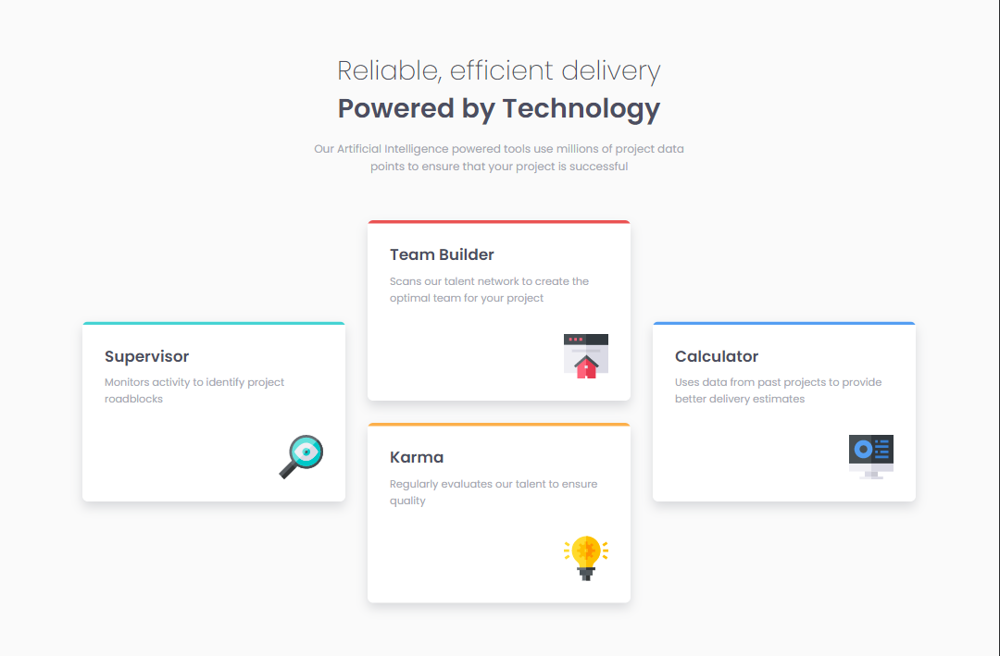

# Frontend Mentor - Four card feature section solution

This is a solution to the [Four card feature section challenge on Frontend Mentor](https://www.frontendmentor.io/challenges/four-card-feature-section-weK1eFYK).

## Table of contents

- [Overview](#overview)
  - [Challenge](#challenge)
  - [Screenshot](#screenshot)
  - [Links](#links)
- [My process](#my-process)
  - [Built with](#built-with)
  - [What I learned](#what-i-learned)
  - [Continued development](#continued-development)
  - [Useful resources](#useful-resources)
- [Author](#author)

## Overview

### Challenge

Users should be able to:

- View the optimal layout depending on their device's screen size.

### Screenshot

### Links

- Solution URL: [See the code on GitHub](https://github.com/KristinaRadosavljevic/four-card-feature-section)
- Live Site URL: [View live site](https://four-card-feature-section-tau-gules.vercel.app/)

## My process

### Built with

- Semantic HTML5 markup
- CSS/Sass
- CSS grid
- Flexbox
- Animations

### What I learned

This was a somewhat interesting challenge, which gave me the opportunity to really practice CSS grid (particularly the `grid-template-areas` property) in the context of media queries. I also started looking into animations a bit.

### Continued development

I would like to expand the use and complexity of animations in the future projects as it seems like a pretty useful and flexible tool.

### Useful resources

In this project, I decided to dig a bit deeper into the issue of centering content using the grid, and [this YouTube video](https://www.youtube.com/watch?v=vNwoDkn7AIc&ab_channel=KevinPowell) in particular helped me fugure out the difference between `place-items` and `place-content`.

## Author

- LinkedIn - [Kristina Radosavljevic](https://www.linkedin.com/in/radosavljevic-kristina/)
- GitHub - [KristinaRadosavljevic](https://github.com/KristinaRadosavljevic)
- Frontend Mentor - [@KristinaRadosavljevic](https://www.frontendmentor.io/profile/KristinaRadosavljevic)
